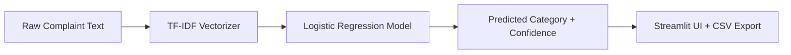

<!-- ===================== HERO ===================== -->
<div align="center">

# 🚀 Chargeback Dispute Intelligence System  
### _NLP Risk Scoring • Complaint Routing • Streamlit Deployment_

<p align="center">
  
  
  
  
</p>

<p align="center">
  <a href="https://chargeback-dispute-intelligence-system-nlp-risk-scoring----pro.streamlit.app/">
    
  </a>
  <a href="#-how-to-run">
    
  </a>
  <a href="#-tech-stack">
    
  </a>
</p>

</div>

---

## ✨ Project Overview
A **compact, production‑ready system** that reads raw consumer complaints, predicts the correct **operational issue category**, and returns a **confidence score** — enabling ops teams to **route and resolve disputes faster** with **less manual effort**.

✅ **Single‑text prediction**  
✅ **Batch CSV inference**  
✅ **TF‑IDF + Logistic Regression**  
✅ **Deployable Streamlit app**  

---

## 🔗 Live App
**Streamlit Demo:**  
👉 https://chargeback-dispute-intelligence-system-nlp-risk-scoring----pro.streamlit.app/

---

## 📌 What I Built
- End‑to‑end NLP pipeline from free‑text complaint → category + confidence.  
- Lightweight Streamlit UI for **single** + **batch** prediction.  
- Safe, reproducible artifacts (**vectorizer + model**) for production inference.  
- Deployment‑ready repo with consistent environment pinning.

---

## 📊 Dataset
Trained and validated using an **authentic consumer‑complaint dataset** derived from the **Consumer Financial Protection Bureau** complaint archive.  
Includes real customer narratives, historical issue labels, metadata, company names, and dates.

---

## 🧠 Why This Matters
| Problem | Impact |
|--------|--------|
| Manual complaint tagging | Slow, inconsistent, expensive |
| High complaint volume | SLA risk + chargeback risk |
| Mis‑routing | Delayed resolution + customer churn |

✅ **Automated triage improves resolution speed and risk handling.**

---

## 🧰 Tech Stack
| Layer | Technology |
|------|-----------|
| NLP | TF‑IDF Vectorization |
| Models | Logistic Regression (deployed), SVM (baseline) |
| Serving | Streamlit |
| Persistence | Joblib |
| Data | pandas, numpy |
| ML | scikit‑learn |

---

## 🧪 Techniques & Approach
- **EDA**: text length distribution, class imbalance, duplicates, missing values.  
- **Preprocessing**: normalization, low‑signal removal, audit‑friendly raw text retention.  
- **Feature Engineering**: fixed vocabulary TF‑IDF for production reliability.  
- **Modeling**: Logistic Regression (selected), SVM (comparison).  
- **Deployment**: serialized artifacts loaded in Streamlit.

---

## 🔥 App Workflow (User Flow)
1. Paste complaint text (or upload CSV).  
2. Vectorize with saved TF‑IDF.  
3. Predict issue category + confidence.  
4. Download enriched CSV for downstream routing.

---

## 🏗️ Architecture (High Level)



---

## ✅ Key Results
- Logistic Regression produced **best balanced F1** across classes.  
- Confidence scores are real probabilities (transparent uncertainty).  
- Focused on **operational usefulness**, not inflated metrics.

---

## ⚠️ Problems Faced & Solutions
| Challenge | Fix |
|---------|-----|
| Label leakage → unreal 100% scores | Removed label tokens; corrected split |
| Pickle incompatibility | Re‑saved artifacts with joblib |
| Version mismatch | Pinned scikit‑learn version |

---

## 📁 Repo Contents
| File | Purpose |
|------|---------|
| `ConsumerComplaintClassification.ipynb` | EDA + model experiments |
| `app.py` | Streamlit app |
| `tfidf_vectorizer.joblib` | TF‑IDF artifact |
| `customer_classification_model_lr.joblib` | Logistic Regression model |
| `requirements.txt` | Runtime dependencies |
| `README.md` | Documentation |

---

## 🧪 How to Run

### ✅ Install
```bash
pip install -r requirements.txt
```

### ✅ Run App
```bash
streamlit run app.py
```

---

## 🌟 Future Improvements
- Top‑N suggestions and correction feedback loop  
- Confidence threshold → human escalation  
- Add metadata features (product, region, time)  
- Explainability (keyword highlights)  

---

## 👤 Author
**Gaurav Singh**  
Project for NLP‑driven operational triage & risk scoring.  
**Live Demo:** https://chargeback-dispute-intelligence-system-nlp-risk-scoring----pro.streamlit.app/

---

<div align="center">

### ⭐ If you like this project, consider starring the repo!

</div>
